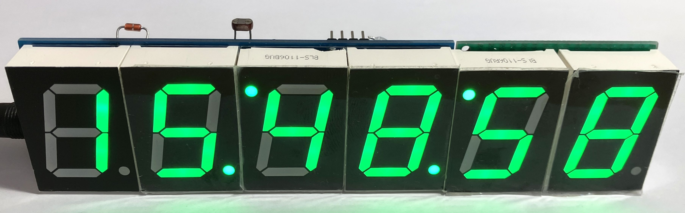
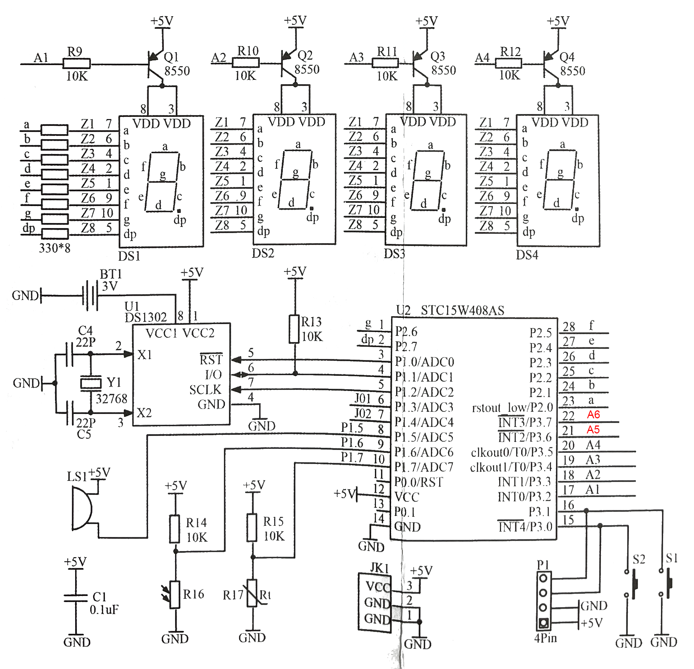
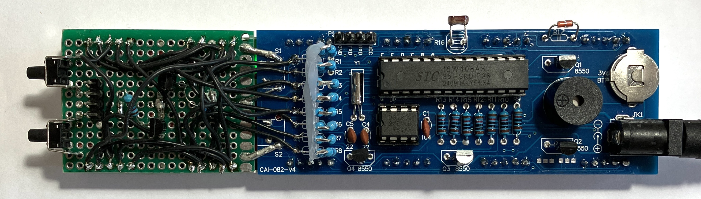
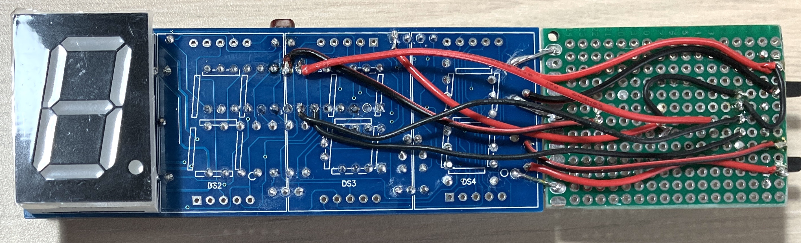
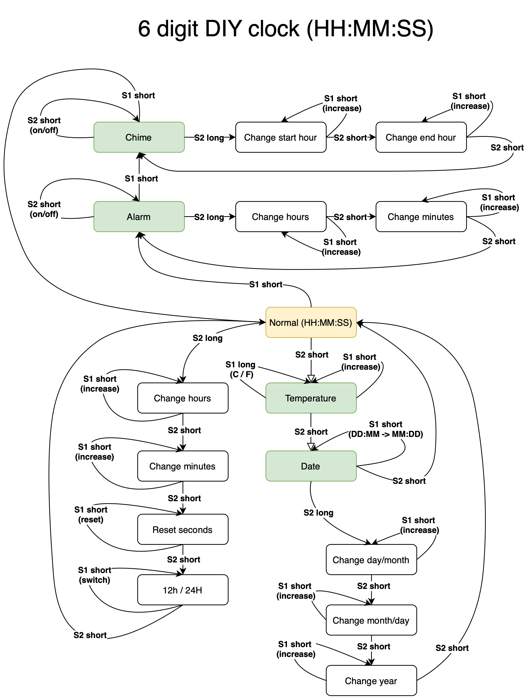

# 6 digit (HH:MM:SS) version

Based on the version without the music chip. 

Additional segments are connected to pins 21 and 22 of the MCU.

## Board

The main board is extended with a piece of a pcb on which additional segments, transistors and buttons are mounted.

## Firmware

The firmware is updated to display seconds on additional segments. To the enable the 6 digit support is must be built with the SIX_DIGITS flag.

The operational flow and the screens are updated as well.

