# 6 digit (HH:MM:SS) modification

1. [Board](#board)
2. [Schematic](#schematic)
3. [Firmware](#firmware)
4. [Operation flow](#operation-flow)
5. [Time synchronization](#time-synchronization)
5. [Case](#case)

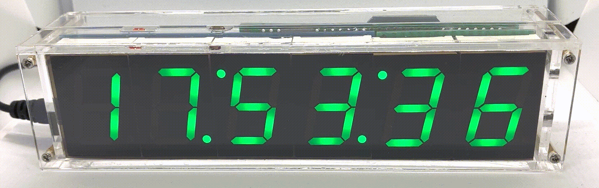

## Schematic

The device is based on the version without the music chip - in this version, the MCU has enough free pins to connect additional segments and an NMEA device. 

[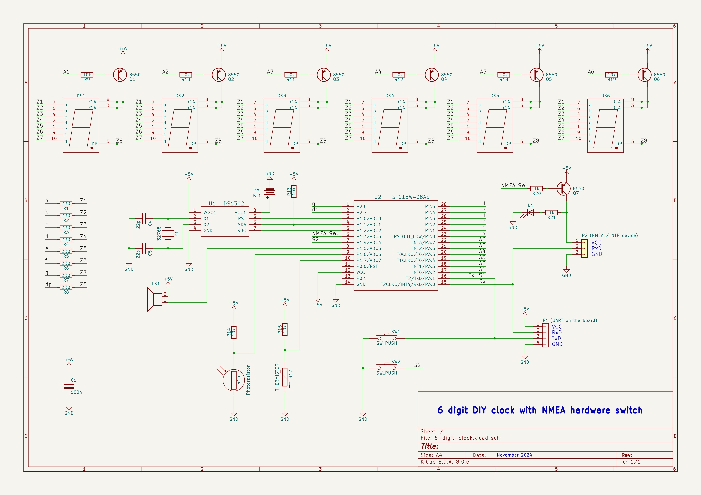](schematic/6-digit-v1.jpg)

Additional segments are connected to **pins 21 (P3.6)** and **22 (P3.7)** of the MCU. 
The S2 button was originally connected to **pin 15 (P.3)**, but I had to connect to the **pin 7 (P1.4)** instead. The reason for this was that I wanted to receive data from an NMEA device on **pin 15 (P3.0)**. This mapping occurs when the constant `MAP_SW2_TO_P1_4` is defined.

> If you are not planning to synchronize time via NTP or GPS, then the S2 button can be connected to pin 15.

I wanted the NMEA device to be on only during the synchronization process. To achieve this, I added a transistor switch (Q7 on the schematic) connected to **pin 6 (P1.3)**. There is also an LED (D1) indicating that the NMEA device is on. 

The rest of the schematic is as original.

## Board

The main board is extended with a piece of a prototyping board on which additional segments, transistors and buttons are mounted.

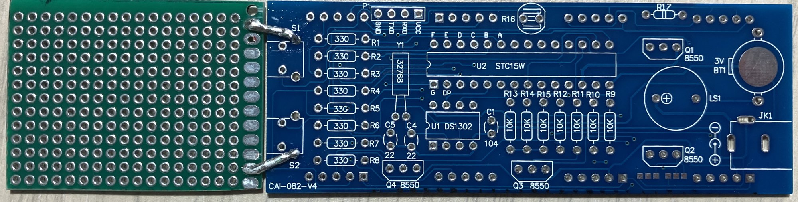

    
More photos here

    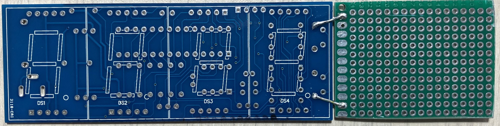
    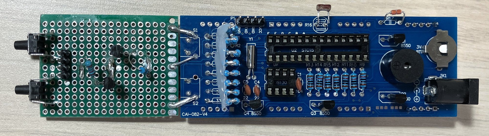
    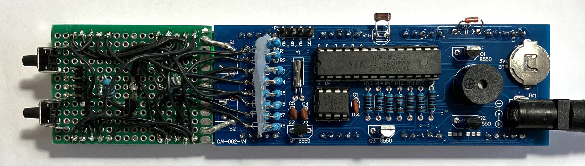
    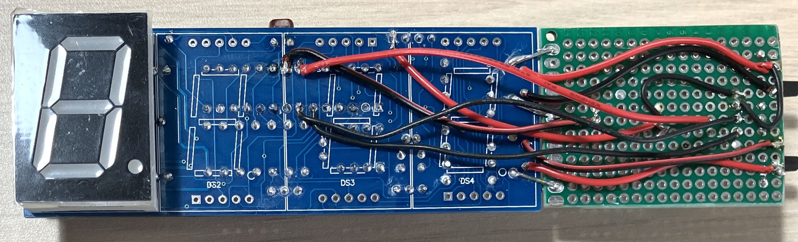
    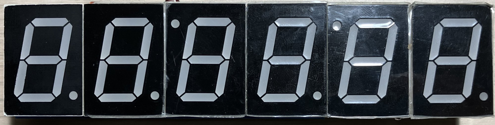
    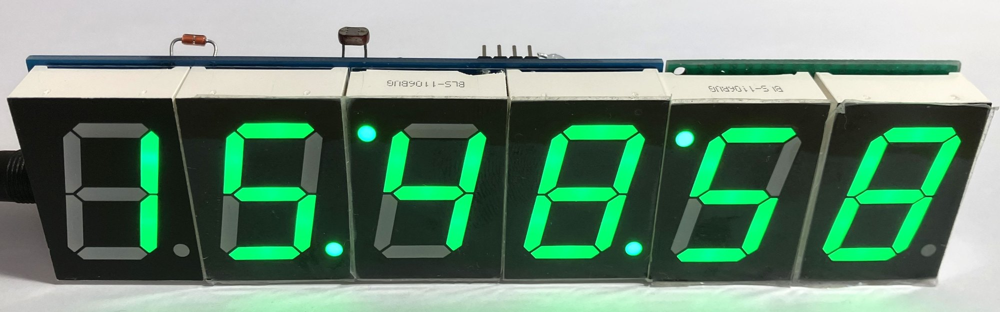

## Firmware

> **Note:** The firmware is fully backward compatible with the original 4-digit version.

The firmware is updated to display seconds on additional segments. To the enable the 6 digit support it must be built with the `SIX_DIGITS` constant defined. Almost all screens were updated to take advantage of the additional segments.

### New screens
- Main
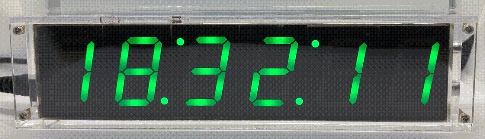

- Temperature
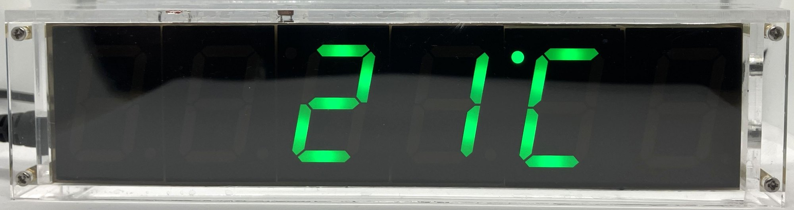

- Date
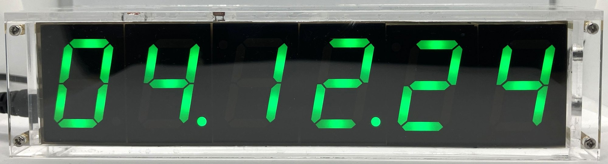

- Alarm
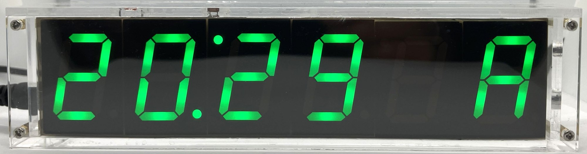

- NMEA settings
  - Timezone (1 h)
  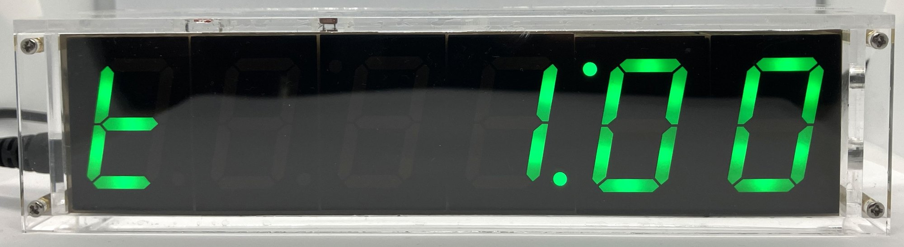
  - Timezone (-12 h)
  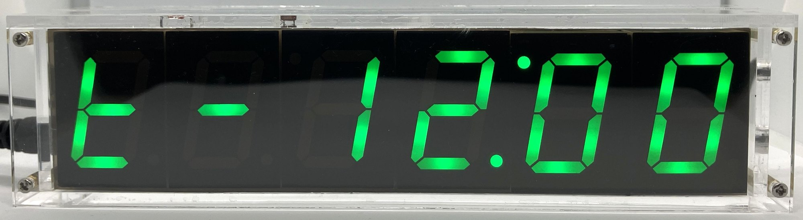
  - DST (daylight saving time) is ON
  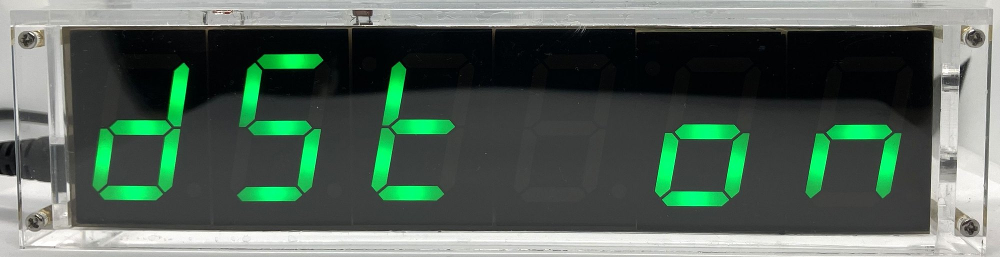
  - DST (daylight saving time) is OFF
  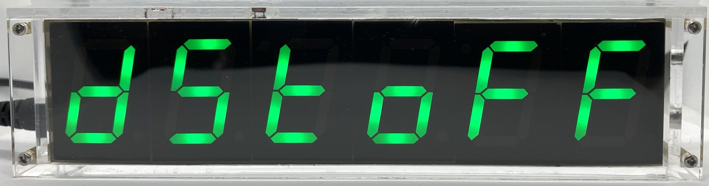
  - Automatic time synchronization is set to 3 hours
  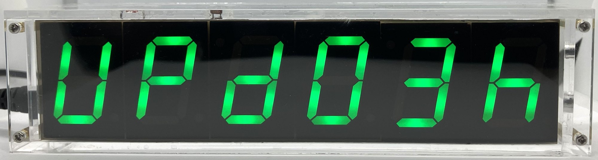
  - Automatic time synchronization is OFF
  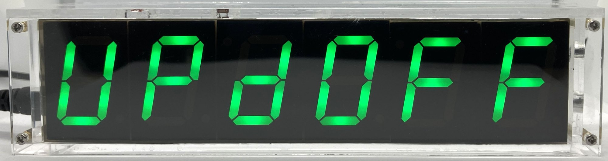

## Operation flow
The operation flow is shown on the following diagram:

[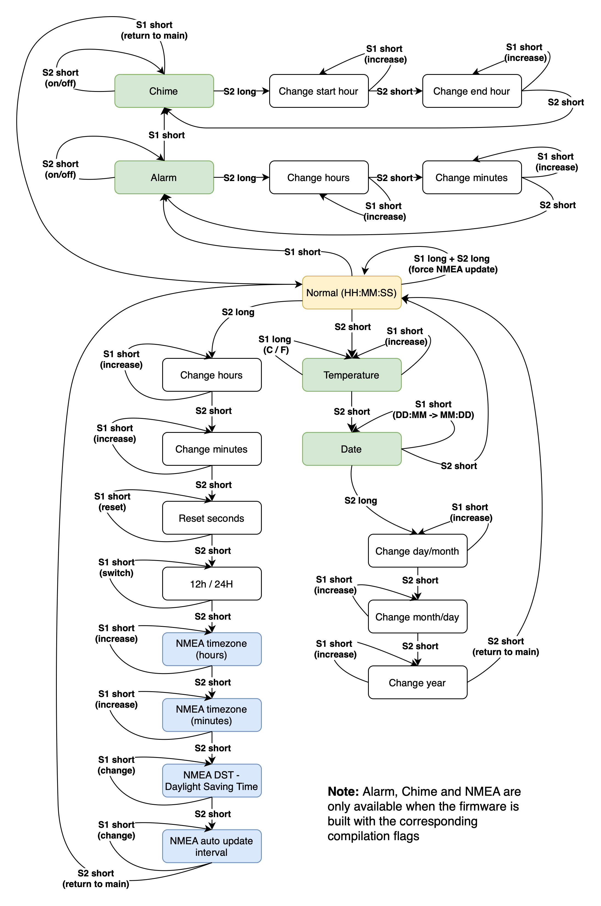](images/6-digit-clock-operation-flow.png)

## Time synchronization

Time can be synchronized with an NMEA device - either a GPS receiver or a microcontroller using the NTP protocol. For the second option, you need to use an ESP8266 Wi-Fi module.

I consider the first version of the clock as experimental, so I decided to place an NMEA receiver together with the transistor switch on a separate prototyping board which is attached to the main board. In this way I gave myself the opportunity to experiment, in a stable version it could be done better and more compactly.

### GPS synchronization

More detailed information can be found in the [GPS synchronization](../nmea/NMEA.md#gps-syncronisation) section.

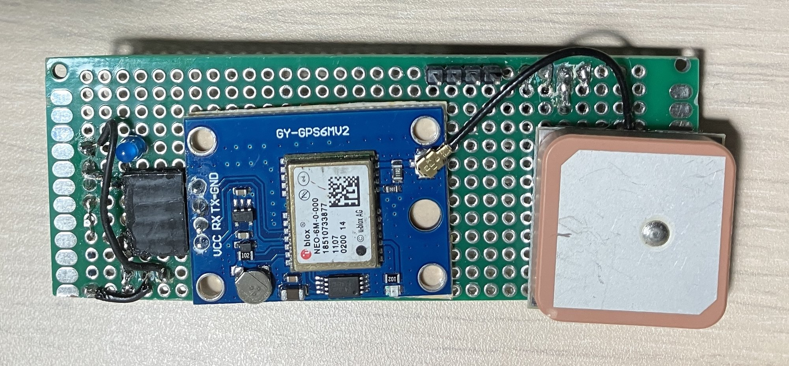
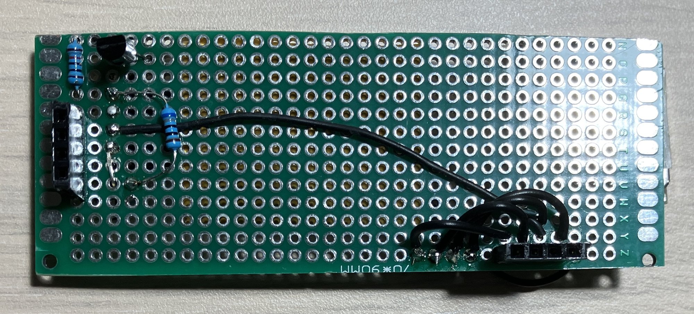

### NTP Syncronisation

More detailed information can be found in the [NTP synchronization](../nmea/NMEA.md#ntp-syncronisation) section.

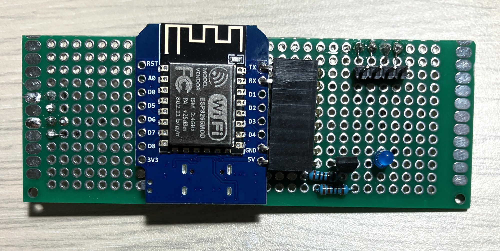
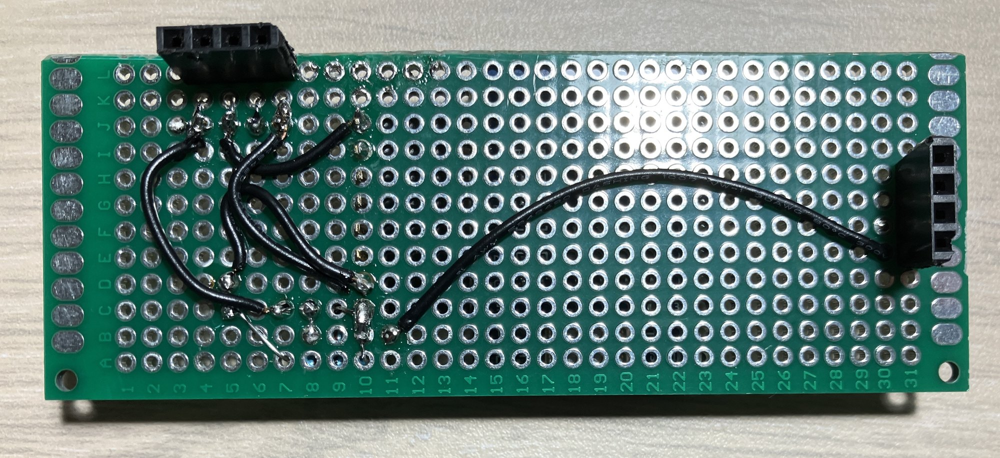

## Case

The case is made from 3mm thick clear acrylic using laser cutting. It consist of 7 parts, designed in Inkscape, the design can be found [here](case/6-digit-case.svg). The parts are glued together to form the front and back sides, which are connected with 2mm screws and spacers.

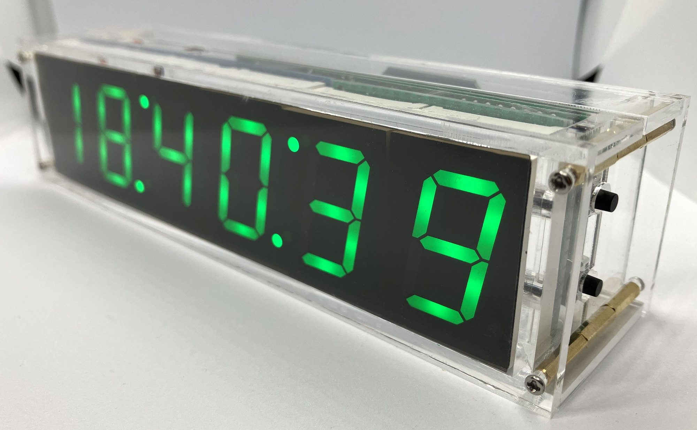

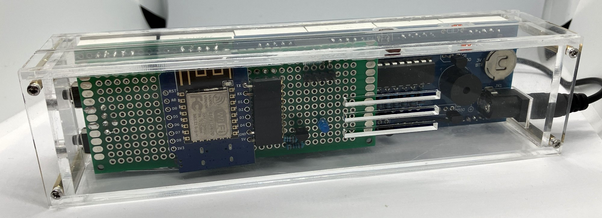
