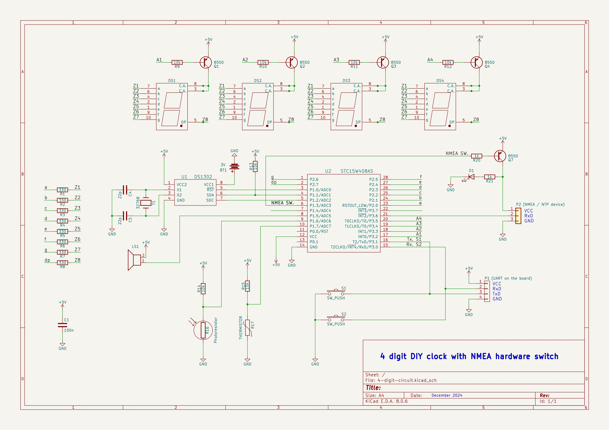
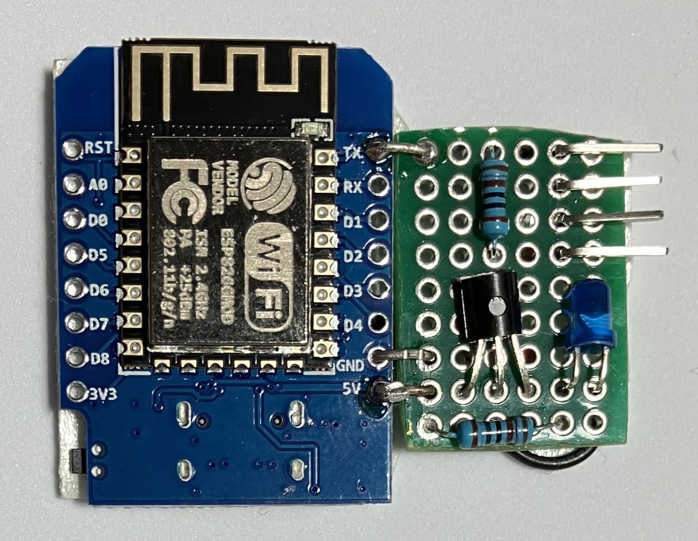
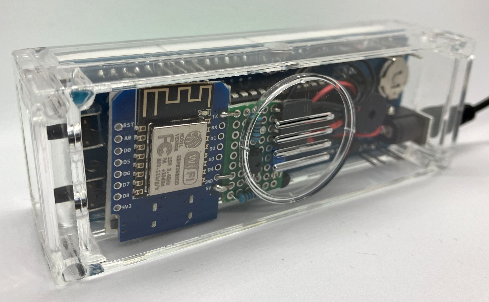
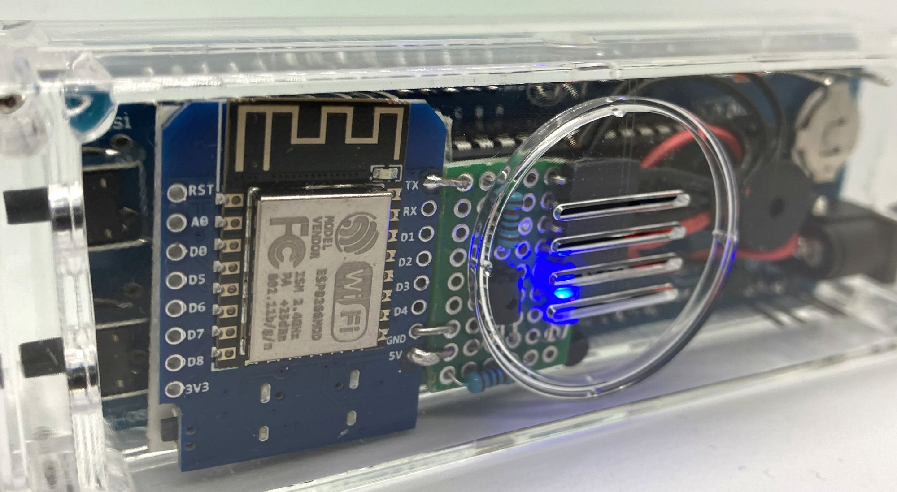
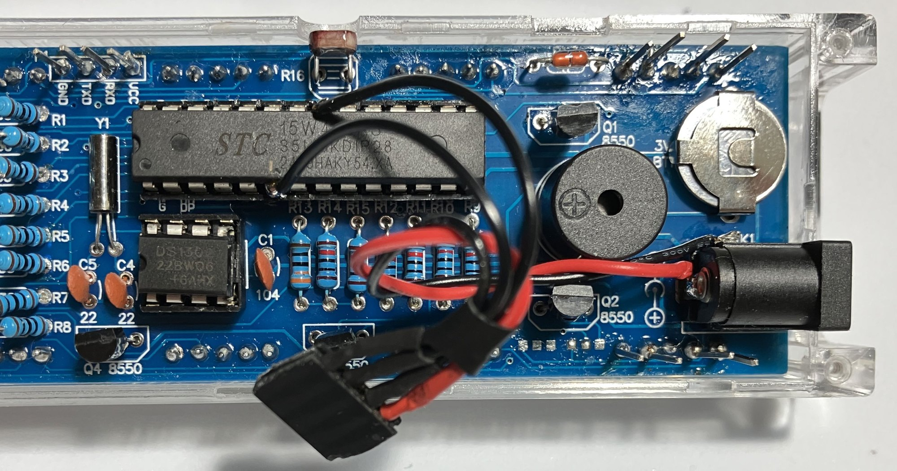
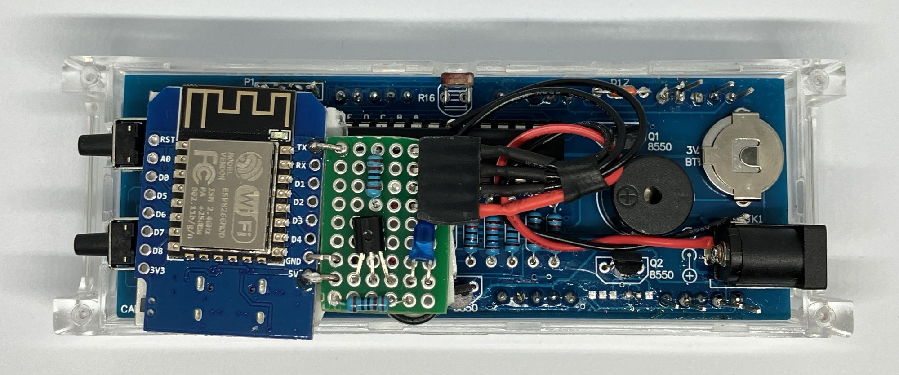
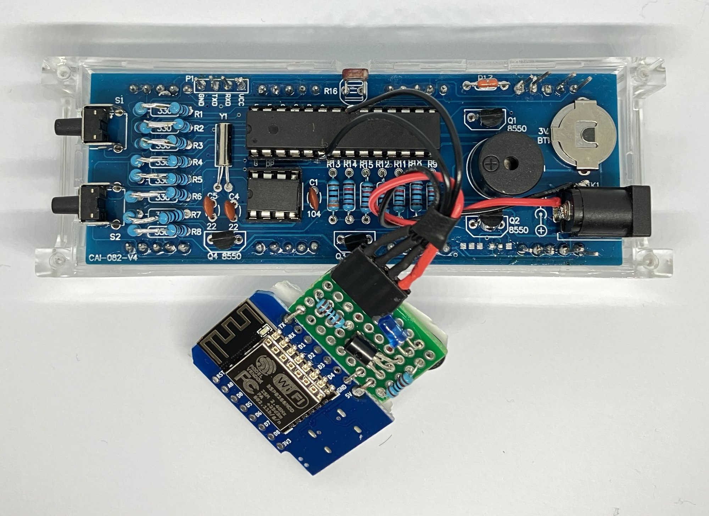

# Time syncronisation with NMEA devices

> NMEA is an acronym for the National Marine Electronics Association.

## Requirements

-  `STC15W408AS` MCU with > 4K flash.

## Firmware

1. The firmware must be compiled with the `WITH_NMEA` flag. The makefile settings should be updated for large firmware:

```c
STCCODESIZE ?= 8184

SDCCOPTS ?= --code-size $(STCCODESIZE) --stack-auto --iram-size 256 --xram-size 256 --data-loc 0x30
```

> **_NOTE:_**  The above settings are applied automatically when calling *make* with the `NMEA=1` parameter:
> 
> ```c
> make NMEA=1
> ```

2. Serial port speed can be changed in [nmea.h](../../src/nmea.h) according to your device:

```c
#define BAUDRATE 9600
```
3. The user can change the auto update interval or disable it. Available options are: `Off`, `3 hours`, `6 hours`, `12 hours` and `24 hours` (see the `NMEA_AUTOSYNC` enum).

> Synchronization is forced when one of the NMEA settings is changed and can also be forced by long pressing the **S1** and **S2** buttons from the main screen (HH:MM).

## Hardware

I wanted an NMEA device to be ON only during the synchronization process. To achieve this, I added a transistor switch connected to **pin 6 (P1.3)**. There is also an LED indicating that the NMEA device is on. 

The firmware turns on the NMEA device according to the user-defined update interval, waits for data from the device, and turns it off. The maximum duration of the synchronization process is 30 minutes, it is hardcoded (see the `NMEA_MAX_SYNC_DURATION` constant).

The NMEA data is received on pin **21**.

[](../4-digit-circuit/4-digit-circuit.jpg)

> **Note:** In my version of this DIY kit, both pins **6** and **21** are not connected to anything else on the board (just "hanging in the air"). This means that the wires to these pins musted be soldered in advance, before soldering the 7-segments indicators.

## GPS syncronisation
I experimented with two types of GPS receivers: `NEO-6MV2` and `NEO-M8N`. Both work great, but the second one receives more satellites, supports multiple GNSS systems (Beidou, Galileo, GLONASS, GPS/QZSS), returns the result quicker, consumes less power.
> **Note:** Strings returned by the `NEO-M8N` receiver have the (`$GNRMC`) prefix instead of the `$GPRMC` returned by the `NEO-6MV2`. 
> 
> The first two characters indicate the signal source. The prefix `GP` means GPS, the prefix `GN` is used in case of mixed signals. 
> 
> The firmware supports both types of receivers out of the box.

It is not practical to use GPS synchronization indoors because the receiver does not receive satellite signals well. But the situation improves when the clock is placed at a window.

## NTP syncronisation

For the NTP syncronisation I decided to use a `WeMos D1 Mini` board. It has a build-in voltage regulator (5V -> 3.3V), so it can be powered directly from 5V and it also has a USB-C connector so can be directly connected to a laptop to upload code.

The transistor switch together with the LED and connector are mounted on a piece of prototyping board soldered to the WeMos D1 mini board.



The code is pretty simple, can be found [here](ESP8266_ntp/ESP8266_ntp.ino) and uploaded to the board using the Arduino studio.

On the first run (or when the saved WiFi network is not available), it creates a WiFi access point with the name `Hodiki` and password `24diyclock24`. Once connected to this access point, you can specify the WiFi network (name and password) that should be used for sending NTP requests.

The original case has enough space for the board:


The LED is indicating that the synchronization is in progress:



> **Note:** This particular kit had been built before I decided to add the NTP support, so I had to solder the wires directly to the MCU (which is not very good).






